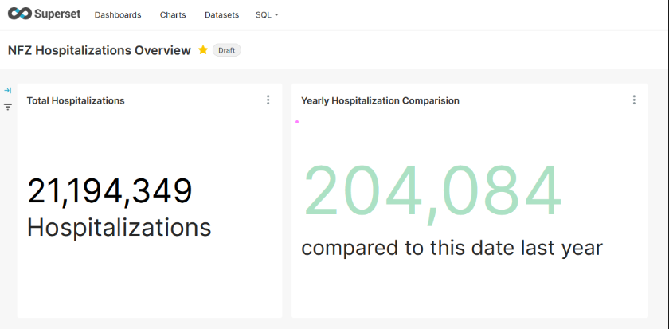

# Analyzing 21,194,349 Hospitalization Records from Poland's National Health Fund (NFZ)
## **Comprehensive  ETL, Data Warehousing, Processing & Visualization Project**
## A Low-Level Approach with SQL, Shell Scripts, SQLLoader and Apache Superset

```keywords
#batch #dwh #datamart #nfz #data #etl #bi #visualisation #healthcare #dataengineering
#analyst #pipeline #dataops #batch #shell #oracle #apachesuperset #sqlcl #docker #pluggabledb
```
---
## Sneak Peek
Let's start with a quick preview to grab your attention. I've prepared comprehensive cross-sectional descriptions and installers (shell & SQL scripts) for various versions of my reports. Of course, you don't have to go through the installation process. For more details, simply scroll down.

Here are two dashboard options available in my project:

- **Modern approach**



*Apache Superset: BI Visualisation with application side processing (in progress!)*

- **Classic approach**


```
SQL> select total_hospitalization_in_dataset
  2*  from rpt_totalhosp;
  
TOTAL_HOSPITALIZATION_IN_DATASET
___________________________________
21,194,349
```

*SQlCl: DB Object with Text Output*

---
# Start
## Introduction
This project is based on real NFZ data sourced from the open-data portal, dane.gov.pl.
The dataset comprises all hospitalizations covered by the NFZ (National Health Fund of Poland) in 2019-2022 *.

- [Dane dotyczące hospitalizacji rozliczonych JGP w latach 2019-2021 ](https://dane.gov.pl/pl/dataset/3009,dane-dotyczace-hospitalizacji-rozliczonych-jgp-w-l/resource/45162) (containt hospitalizations start with 2017, 2018)
- [Dane dotyczące hospitalizacji rozliczonych JGP w latach 2022 ](https://dane.gov.pl/pl/dataset/3009,dane-dotyczace-hospitalizacji-rozliczonych-jgp-w-l/resource/54046)

The dataset comprises over 20 million records, with each record representing an individual patient's hospitalization data.

It's based on the public goverment repositories hub named data.gov.pl.

- [Source Licence](https://creativecommons.org/publicdomain/zero/1.0/legalcode.pl)

Used repository is not bad quality, but I saw small differences between files. I want to make some improvements, create DWH star schema, materialized view as fact table, dimensions etc...
I will clean and process the data to visualize it with Apache Superset.

## Tech stack
This repository showcases my Data Engineering project, highlighting my diverse data-related skills. 
It includes database administration, data warehousing, and ETL development tasks.
My objective is to prepare and process this data for visualization purposes, including the creation of charts and dashboards. I aim to learn modern data visualization BI tool.

The project is currently only available on my localhost, so included some scripts and documentation images for the initial version.

| Tool/Software           | Description                           |
|-------------------------|---------------------------------------|
| **Visualization**       |                                       |
| Apache Superset        | Visualization tool                    |
| **Data Cleaning**       |                                       |
| Oracle SQL             | Data cleaning and manipulation        |
| **Virtual Machines**    |                                       |
| VM 1                    | Oracle Linux with DB 21               |
| VM 2                    | Centos, Docker, Apache Superset container with cx_oracle connector |
| **Shell Scripting**     |                                       |
| MINGW Bash              | Shell scripting                       |
| **Data Loading**        |                                       |
| SqlLoader               | Data loading                          |
| **IDE**                 |                                       |
| SQLDeveloper 23         | IDE for DBA tasks and queries         |
| Visual Studio Code      | IDE with new Oracle plugin            |
| **Database Tools**      |                                       |
| SQLPlus & SQLCli        | Database command-line interface      |
| **Others**              |                                       |
| PlantUml                | Tool for diagrams                     |
| GIT                     | Version control system                |
 
## Data source
### NFZ source Data preview (CSV)
ROK;MIESIAC;OW_NFZ;NIP_PODMIOTU;KOD_PRODUKTU_KONTRAKTOWEGO;KOD_PRODUKTU_JEDNOSTKOWEGO;KOD_TRYBU_PRZYJECIA;KOD_TRYBU_WYPISU;PLEC_PACJENTA;GRUPA_WIEKOWA_PACJENTA;PRZEDZIAL_DLUGOSCI_TRWANIA_HOSPITALIZACJI;LICZBA_HOSPITALIZACJI
2022;4;"07";"1132866688";"03.4580.991.02";"5.51.01.0008013";6;2;"K";"65 i wiecej";"6 i wie™cej dni";"<5"
2022;8;"02";"5562239217";"03.4220.030.02";"5.51.01.0001087";3;2;"K";"45-64";"6 i wiecej dni";"<5"
2022;11;"03";"9462146139";"03.4580.991.02";"5.51.01.0008015";6;2;"K";"65 i wiecej";"6 i wiecej dni";"<5"
2022;9;"15";"7842008454";"03.4450.040.02";"5.51.01.0012014";3;2;"K";"65 i wiecej";"0 dni";"<5"
### Domain dictionaries
The data contains some foreign keys pointing to static dictionaries:

**The dictionary source for Polish HL7 implementations includes**
- discharge modes https://www.cez.gov.pl/HL7POL-1.3.2/plcda-html-1.3.2/plcda-html/voc-2.16.840.1.113883.3.4424.13.11.36-2015-10-26T000000.html
- admision modes

## My DWH DB model
I had to transform the source file into a star schema model for that data mart...


*Figure 1: DWH Model*

### Database Objects & Names Explanation
As a DBA, I handle database creation, structure definition, user management, and permissions...

### DB Instance

| Object Type                | Object Name                        | Description                           |
|----------------------------|------------------------------------|---------------------------------------|
| **Pluggable Database (PDB)**| datamart                           |                                       |
| **Application schema**     | dm_nfzhosp                         |    

### Roles

| Role         | Description                           |
|--------------|---------------------------------------|
| R_ENGINEER   | Used for developers with strong privileges.   |
| R_ANALYST    | Used for analysts.                             |

### Users

| User       | Description              |
|------------|--------------------------|
| sysdm      | Data Mart Administrator  |
| C##JDOE    | Data Analyst 💁          |
| C##JSMITH  | Database Developer 🙋    |
| sys        | Oracle Root User         |

### Synonyms

| Synonym             | Description            |
|---------------------|------------------------|
| F_HOSPITALIZATIONS  |                        |

### Tables

| Table               | Description            |
|---------------------|------------------------|
| DIM_CONTRACTS       |                        |
| DIM_DATE            |                        |
| DIM_DEPARTMENTS     |                        |
| DIM_INSTITUTIONS    |                        |
| DIM_NFZADMISSIONS   |                        |
| DIM_NFZDISCHARGE    |                        |
| DIM_SERVICES        |                        |
| HOSPITALIZACJE_CSV  |                        |
| MV_HOSPITALIZATIONS |                        |

### Views

| View                 | Description            |
|----------------------|------------------------|
| RPT_TOTALHOSP       |                        |
| V_HOSPITALIZATIONS  |                        |
| V_TRNSLTD_HOSPITALIZATIONS |                   |

## Installation
I've prepared some bash and SQL scripts to create database, structures and objects and automate the installation process. You can use either install.sh or rebuild.sh to get started.

**Tool**
- Set up default coding to UTF-8 (SQLDeveloper, Sublime, DB instance)

**Data Part:**
- Set up the Oracle database.
- Copy the repository
- Review server parameters (TNS, IP, service name) in the sql/ directory scripts and install.sh
- Run the install.sh script (the script will prompt for database passwords for security and a better user experience)


*Figure 1: Demonstration of the script execution process (gif animations)*

**Visualization Tool:**

- Configure the Apache Superset datasource and dataset with c##jdoe credentials (analytical role), using SqlAlchemu url

`url
oracle+cx_oracle://c##jdoe:oracle@(DESCRIPTION=(ADDRESS=(PROTOCOL=TCP)(HOST=192.168.0.51)(PORT=1521))(CONNECT_DATA=(SERVER=DEDICATED)(SERVICE_NAME=datamart)))
`
- Set up charts (but you can also use simple text-based version of reports)

## Dashboard & Reports Results
Of course you don't have to go through the installation process. Simply open the text-based dashboard or view the visualization screenshots. However, if you're a professional user, you can review my analysis queries (along with all other scripts) by navigating to the sql/ GitHub directory.

**HR / Regular user**
- [View the text-based dashboard](dashboard-as-text.md)
- [View the Apache Superset dashboard](dashboard-superset.md)

**IT professional user**
- [Review my queries in sql/5-create-reports-as-analyst.sql](sql/5-create-reports-as-analyst.sql)

---
